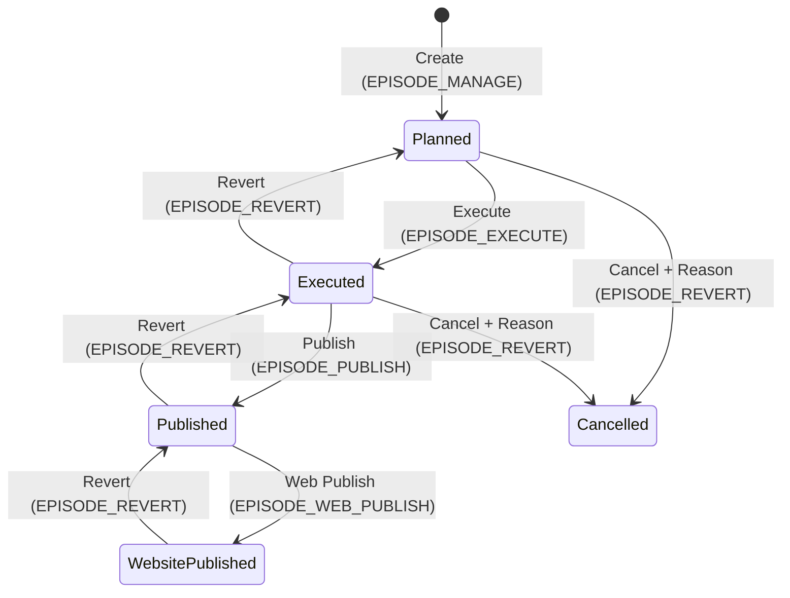
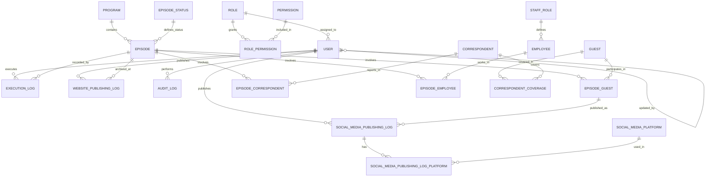

# Radio Broadcast Workflow System — Domain Documentation
# نظام إدارة دورة حياة البث الإذاعي — توثيق طبقة الـ Domain

> **AI Quick Context | سياق سريع للذكاء الاصطناعي**
> 
> This document is designed to be parsed and understood by AI models. It contains the complete domain layer specification for the Radio Broadcast Workflow System.
> 
> يهدف هذا المستند إلى أن يُفهم ويُحلل بواسطة نماذج الذكاء الاصطناعي. يحتوي على المواصفة الكاملة لطبقة الـ Domain لنظام إدارة دورة حياة البث الإذاعي.

---

## Table of Contents | فهرس المحتويات

1. [Architecture Overview | نظرة عامة على المعمارية](#1-architecture-overview--نظرة-عامة-على-المعمارية)
2. [BaseEntity — The Foundation | الكيان الأساسي](#2-baseentity--the-foundation--الكيان-الأساسي)
3. [Identity & Access Control | الهوية و التحكم بالوصول](#3-identity--access-control--الهوية-والتحكم-بالوصول)
4. [Core Business Entities | كيانات العمل الأساسية](#4-core-business-entities--كيانات-العمل-الأساسية)
5. [Episode Lifecycle & State Machine | دورة حياة الحلقة وآلة الحالات](#5-episode-lifecycle--state-machine--دورة-حياة-الحلقة-وآلة-الحالات)
6. [People & Roles | الأشخاص والأدوار](#6-people--roles--الأشخاص-والأدوار)
7. [Publishing & Social Media | النشر ووسائل التواصل](#7-publishing--social-media--النشر-ووسائل-التواصل)
8. [Audit & Logging | التدقيق والسجلات](#8-audit--logging--التدقيق-والسجلات)
9. [Entity Relationship Diagram | مخطط علاقات الكيانات](#9-entity-relationship-diagram--مخطط-علاقات-الكيانات)
10. [Critical Architectural Decisions | قرارات معمارية حرجة](#10-critical-architectural-decisions--قرارات-معمارية-حرجة)
11. [Anti-Patterns & Warnings | الأنماط المضادة والتحذيرات](#11-anti-patterns--warnings--الأنماط-المضادة-والتحذيرات)
12. [Database Context & Configuration | سياق قاعدة البيانات والإعدادات](#12-database-context--configuration--سياق-قاعدة-البيانات-والإعدادات)

---

## 1. Architecture Overview | نظرة عامة على المعمارية

### Layer Structure | هيكل الطبقات

```
Radio.sln
├── Domain/                  # طبقة البيانات والكيانات
│   └── Models/
│       ├── BaseEntity.cs
│       ├── BroadcastWorkflowDBContext.cs
│       ├── Configurations/  # Fluent API لكل كيان
│       └── [Entities].cs    # 20+ كيان
│
├── DataAccess/              # طبقة منطق الأعمال
│   ├── Common/
│   │   ├── Result.cs
│   │   ├── SecurityHelper.cs
│   │   └── AppPermissions.cs
│   ├── Data/
│   │   └── AuditInterceptor.cs
│   ├── DTOs/
│   ├── Services/
│   └── Seeding/
│
└── Radio/                   # طبقة العرض (WPF Desktop)
```

### Golden Rules (3 Rules) | القواعد الذهبية (3 قواعد)

| # | Rule | القاعدة |
|---|------|---------|
| 1 | **Result Pattern Only** | جميع الخدمات ترجع `Result` أو `Result<T>`. لا استثناءات للأخطاء المتوقعة. |
| 2 | **BaseEntity for Everything** | كل جدول قابل للتدقيق يرث من `BaseEntity` (يتضمن: `IsActive`, `CreatedAt`, `UpdatedAt`, `CreatedByUserId`, `UpdatedByUserId`, `RowVersion`). |
| 3 | **AuditInterceptor Handles Auditing** | لا تكتب كود تدقيق يدوي في الخدمات. الـ `AuditInterceptor` يعترض كل `SaveChanges` تلقائياً. |

---

## 2. BaseEntity — The Foundation | الكيان الأساسي

### C# Definition | التعريف

```csharp
public abstract class BaseEntity
{
    public bool IsActive { get; set; } = true;                    // Soft Delete flag
    public DateTime CreatedAt { get; set; } = DateTime.UtcNow;    // Creation timestamp
    public DateTime UpdatedAt { get; set; } = DateTime.UtcNow;    // Last update timestamp
    public int? CreatedByUserId { get; set; }                      // FK to User (creator)
    public int? UpdatedByUserId { get; set; }                      // FK to User (updater)

    [Timestamp]
    public byte[] RowVersion { get; set; } = null!;               // Optimistic Concurrency

    // Navigation Properties
    public virtual User? CreatedByUser { get; set; }
    public virtual User? UpdatedByUser { get; set; }
}
```

### Inherited By | يرث منه

All entities marked with ✅ below inherit from `BaseEntity` and get automatic auditing, soft delete, and optimistic concurrency.

| Entity | Inherits BaseEntity | Notes |
|--------|---------------------|-------|
| `AuditLog` | ❌ No | Independent audit table |
| `EpisodeStatus` | ❌ No | Lookup table (no auditing needed) |
| `Permission` | ❌ No | Static lookup table |
| `Role` | ❌ No | Has its own `IsActive`, `CreatedAt`, `UpdatedAt`, `RowVersion` |
| `RolePermission` | ❌ No | Pure join table |
| **All others** | ✅ **Yes** | Employee, Episode, Guest, Program, etc. |

### Soft Delete Behavior | سلوك الحذف المنطقي

- **Global Query Filter**: Automatically applied in `BroadcastWorkflowDBContext` for all `BaseEntity` descendants:
  ```csharp
  modelBuilder.Entity<T>().HasQueryFilter(e => e.IsActive);
  ```
- **AuditInterceptor** marks `"SOFT_DELETED"` action when `IsActive` changes from `true` to `false`.
- **No physical deletion** for business entities; only `IsActive = false`.

---

## 3. Identity & Access Control | الهوية والتحكم بالوصول

### 3.1 User | المستخدم

```csharp
public partial class User : BaseEntity
{
    public int UserId { get; set; }
    public string Username { get; set; }           // Unique, Required
    public string PasswordHash { get; set; }       // BCrypt hashed
    public string FullName { get; set; }
    public string EmailAddress { get; set; }
    public string PhoneNumber { get; set; }
    public int RoleId { get; set; }                // FK to Role
    public DateTime? LastLoginAt { get; set; }

    // Navigation
    public virtual Role Role { get; set; }
    public virtual ICollection<ExecutionLog> ExecutionLogs { get; set; }
    public virtual ICollection<SocialMediaPublishingLog> SocialMediaPublishingLogs { get; set; }
    public virtual ICollection<WebsitePublishingLog> WebsitePublishingLogs { get; set; }

    // Self-referencing for audit trail (CreatedBy/UpdatedBy)
    public virtual ICollection<User> InverseCreatedByUser { get; set; }
    public virtual ICollection<User> InverseUpdatedByUser { get; set; }
}
```

| Field | Type | Constraints |
|-------|------|-------------|
| `UserId` | `int` | PK, Identity |
| `Username` | `string` | Unique Index `UQ_Users_Username`, Max 100 |
| `PasswordHash` | `string` | Required, Max 255 |
| `FullName` | `string` | Required, Max 200 |
| `EmailAddress` | `string` | Max 255 |
| `PhoneNumber` | `string` | Max 20 |
| `RoleId` | `int` | FK → `Role.RoleId`, Restrict delete |
| `LastLoginAt` | `DateTime?` | Nullable |

**Seed Data**: `admin` / `Admin@123` (Role: Admin)

---

### 3.2 Role | الدور الوظيفي

```csharp
public partial class Role
{
    public int RoleId { get; set; }
    public string RoleName { get; set; }           // e.g., Admin, ProgramMgr, Director, WebPublisher
    public string RoleDescription { get; set; }
    public bool IsActive { get; set; } = true;
    public DateTime CreatedAt { get; set; }
    public DateTime UpdatedAt { get; set; }
    public byte[] RowVersion { get; set; }

    public virtual ICollection<User> Users { get; set; }
    public virtual ICollection<RolePermission> RolePermissions { get; set; }
}
```

| Role Name | Description | Permissions |
|-----------|-------------|-------------|
| `Admin` | مسؤول النظام | ALL (1-12) |
| `ProgramMgr` | مدير البرامج | PROGRAM_MANAGE, EPISODE_MANAGE, EPISODE_EXECUTE, EPISODE_PUBLISH, EPISODE_EDIT, GUEST_MANAGE, VIEW_REPORTS |
| `Director` | مخرج البث | EPISODE_EXECUTE, VIEW_REPORTS |
| `WebPublisher` | ناشر الموقع | EPISODE_WEB_PUBLISH, VIEW_REPORTS |

---

### 3.3 Permission | الصلاحية

```csharp
public class Permission
{
    public int PermissionId { get; set; }
    public string SystemName { get; set; }         // e.g., USER_MANAGE
    public string DisplayName { get; set; }        // e.g., إدارة المستخدمين
    public string Module { get; set; }             // e.g., المستخدمين

    public virtual ICollection<RolePermission> RolePermissions { get; set; }
}
```

### 3.4 RolePermission | ربط الدور بالصلاحية

```csharp
public class RolePermission
{
    public int RoleId { get; set; }
    public virtual Role Role { get; set; }

    public int PermissionId { get; set; }
    public virtual Permission Permission { get; set; }
}
```

**Composite Key**: `{RoleId, PermissionId}`

### Permission Matrix (12 Permissions) | مصفوفة الصلاحيات

| ID | SystemName | DisplayName | Module |
|----|------------|-------------|--------|
| 1 | `USER_MANAGE` | إدارة المستخدمين | المستخدمون |
| 2 | `PROGRAM_MANAGE` | إدارة البرامج | البرامج |
| 3 | `EPISODE_MANAGE` | إدارة الحلقات | الحلقات |
| 4 | `EPISODE_EXECUTE` | تنفيذ الحلقات | الحلقات |
| 5 | `EPISODE_PUBLISH` | نشر رقمي | الحلقات |
| 6 | `EPISODE_WEB_PUBLISH` | نشر الموقع | الحلقات |
| 7 | `EPISODE_EDIT` | تعديل الحلقات | الحلقات |
| 8 | `EPISODE_DELETE` | حذف الحلقات | الحلقات |
| 9 | `GUEST_MANAGE` | إدارة الضيوف | الضيوف |
| 10 | `CORR_MANAGE` | إدارة التنسيق الميداني | التنسيق |
| 11 | `VIEW_REPORTS` | عرض التقارير | التقارير |
| 12 | `EPISODE_REVERT` | تراجع عن تنفيذ/نشر | الحلقات |

> **Admin Rule**: `RoleName == "Admin"` bypasses ALL permission checks automatically in `SecurityHelper.cs`.

---

## 4. Core Business Entities | كيانات العمل الأساسية

### 4.1 Program | البرنامج الإذاعي

```csharp
public partial class Program : BaseEntity
{
    public int ProgramId { get; set; }
    public string ProgramName { get; set; }        // Unique, Required, Max 200
    public string ProgramDescription { get; set; } // Max 1000
    public string Category { get; set; }           // Max 100

    public virtual ICollection<Episode> Episodes { get; set; }
}
```

**Seed Data**: نشرة الأخبار | صباح الخير | حديث الرياضة | نافذة ثقافية

---

### 4.2 Episode | الحلقة

```csharp
public partial class Episode : BaseEntity
{
    public int EpisodeId { get; set; }
    public int ProgramId { get; set; }             // FK → Program
    public string EpisodeName { get; set; }        // Required, Max 300
    public string EpisodeDescription { get; set; } // Max 2000
    public DateTime? ScheduledExecutionTime { get; set; }
    public DateTime? ActualExecutionTime { get; set; }
    public string SpecialNotes { get; set; }       // Max 1000
    public string? CancellationReason { get; set; } // Max 500, only when StatusId = 4
    public byte StatusId { get; set; }             // FK → EpisodeStatus

    // Navigation
    public virtual EpisodeStatus EpisodeStatus { get; set; }
    public virtual Program Program { get; set; }
    public virtual ICollection<EpisodeGuest> EpisodeGuests { get; set; }
    public virtual ICollection<ExecutionLog> ExecutionLogs { get; set; }
    public virtual ICollection<WebsitePublishingLog> WebsitePublishingLogs { get; set; }
    public virtual ICollection<EpisodeEmployee> EpisodeEmployees { get; set; }
    public virtual ICollection<EpisodeCorrespondent> EpisodeCorrespondents { get; set; }
}
```

**Critical Design Decision**: No `IsWebsitePublished` boolean. Website publish status is determined by `StatusId == 3` OR existence of a record in `WebsitePublishingLogs`.

---

### 4.3 EpisodeStatus | حالة الحلقة (Lookup)

```csharp
public class EpisodeStatus
{
    [Key]
    [DatabaseGenerated(DatabaseGeneratedOption.None)]
    public byte StatusId { get; set; }             // 0, 1, 2, 3, 4 (manual)

    public string StatusName { get; set; }         // System name: Planned, Executed...
    public string DisplayName { get; set; }        // Arabic: مجدولة, منفّذة...
    public byte SortOrder { get; set; }
}
```

| StatusId | StatusName | DisplayName | SortOrder |
|----------|------------|-------------|-----------|
| 0 | `Planned` | مجدولة | 0 |
| 1 | `Executed` | منفّذة | 1 |
| 2 | `Published` | منشورة | 2 |
| 3 | `WebsitePublished` | منشورة على الموقع | 3 |
| 4 | `Cancelled` | ملغاة | 4 |

> **Note**: `EpisodeStatus` is NOT an enum. It is a database lookup table with seed data for SQL compatibility and dynamic display names.

---

## 5. Episode Lifecycle & State Machine | دورة حياة الحلقة وآلة الحالات

### State Transitions | انتقالات الحالات

```
[Start] → Planned (EPISODE_MANAGE)
Planned → Executed (EPISODE_EXECUTE)
Executed → Published (EPISODE_PUBLISH)
Published → WebsitePublished (EPISODE_WEB_PUBLISH)

// Revert operations (EPISODE_REVERT)
WebsitePublished → Published
Published → Executed
Executed → Planned

// Cancel operations (EPISODE_REVERT + CancellationReason)
Planned → Cancelled
Executed → Cancelled
```

### State Machine Diagram | رسم آلة الحالات



### Revert Behavior | سلوك التراجع

- **Does NOT delete records physically**.
- Applies **Soft Delete** (`IsActive = false`) on:
  - `ExecutionLog` records
  - `PublishingLog` records (SocialMedia + Website)
- `CancellationReason` is stored directly in `Episodes` table (not in `AuditLogs`) for fast querying.

---

## 6. People & Roles | الأشخاص والأدوار

### 6.1 Guest | الضيف

```csharp
public partial class Guest : BaseEntity
{
    public int GuestId { get; set; }
    public string FullName { get; set; }           // Required, Max 200
    public string Organization { get; set; }       // Max 200
    public string PhoneNumber { get; set; }        // Max 20
    public string EmailAddress { get; set; }       // Max 255

    public virtual ICollection<CorrespondentCoverage> CorrespondentCoverages { get; set; }
    public virtual ICollection<EpisodeGuest> EpisodeGuests { get; set; }
}
```

---

### 6.2 Correspondent | المراسل

```csharp
public partial class Correspondent : BaseEntity
{
    public int CorrespondentId { get; set; }
    public string FullName { get; set; }           // Required, Max 200
    public string PhoneNumber { get; set; }        // Max 20
    public string AssignedLocations { get; set; }  // Max 500

    public virtual ICollection<CorrespondentCoverage> CorrespondentCoverages { get; set; }
}
```

---

### 6.3 CorrespondentCoverage | تغطية المراسل

```csharp
public partial class CorrespondentCoverage : BaseEntity
{
    public int CoverageId { get; set; }
    public int CorrespondentId { get; set; }
    public int? GuestId { get; set; }
    public string Location { get; set; }           // Max 200
    public string Topic { get; set; }              // Max 500
    public DateTime? ScheduledTime { get; set; }
    public DateTime? ActualTime { get; set; }

    public virtual Correspondent Correspondent { get; set; }
    public virtual Guest Guest { get; set; }
}
```

**Delete Behavior**: `Restrict` on both `Correspondent` and `Guest` — coverage records are historical and must be preserved even if the person is soft-deleted.

---

### 6.4 Employee | الموظف

```csharp
public class Employee : BaseEntity
{
    public int EmployeeId { get; set; }
    public string FullName { get; set; }           // Required
    public int? StaffRoleId { get; set; }          // FK → StaffRole
    public string? Notes { get; set; }

    public virtual StaffRole? StaffRole { get; set; }
    public virtual ICollection<EpisodeEmployee> EpisodeEmployees { get; set; }
}
```

---

### 6.5 StaffRole | دور الطاقم

```csharp
public class StaffRole : BaseEntity
{
    public int StaffRoleId { get; set; }
    public string RoleName { get; set; }           // e.g., مذيع, منفذ, مهندس صوت

    public virtual ICollection<Employee> Employees { get; set; }
}
```

**Design Decision**: `StaffRole` was removed from the join table `EpisodeEmployee` and linked directly to `Employee`. This simplifies relationships; the employee's role is queried from their personal data.

---

### 6.6 EpisodeGuest | ربط الحلقة بالضيف

```csharp
public partial class EpisodeGuest : BaseEntity
{
    public int EpisodeGuestId { get; set; }
    public int EpisodeId { get; set; }
    public int GuestId { get; set; }
    public string? Topic { get; set; }             // Max 500
    public TimeSpan? HostingTime { get; set; }     // TIME column type
    public GuestClipStatus ClipStatus { get; set; } = GuestClipStatus.Pending;
    public string? ClipNotes { get; set; }

    public virtual Episode Episode { get; set; }
    public virtual Guest Guest { get; set; }
    public virtual ICollection<SocialMediaPublishingLog> SocialMediaPublishingLogs { get; set; }
}
```

**Unique Constraint**: `{EpisodeId, GuestId}` — prevents duplicate guest assignment to the same episode.

---

### 6.7 EpisodeCorrespondent | ربط الحلقة بالمراسل

```csharp
public class EpisodeCorrespondent : BaseEntity
{
    public int EpisodeCorrespondentId { get; set; }
    public int EpisodeId { get; set; }
    public int CorrespondentId { get; set; }
    public string? Topic { get; set; }
    public TimeSpan? HostingTime { get; set; }

    public virtual Episode Episode { get; set; }
    public virtual Correspondent Correspondent { get; set; }
}
```

---

### 6.8 EpisodeEmployee | ربط الحلقة بالموظف

```csharp
public class EpisodeEmployee : BaseEntity
{
    public int EpisodeEmployeeId { get; set; }
    public int EpisodeId { get; set; }
    public int EmployeeId { get; set; }

    public virtual Episode Episode { get; set; }
    public virtual Employee Employee { get; set; }
}
```

---

## 7. Publishing & Social Media | النشر ووسائل التواصل

### 7.1 ExecutionLog | سجل التنفيذ

```csharp
public partial class ExecutionLog : BaseEntity
{
    public int ExecutionLogId { get; set; }
    public int EpisodeId { get; set; }
    public int ExecutedByUserId { get; set; }
    public int? DurationMinutes { get; set; }
    public string ExecutionNotes { get; set; }     // Max 2000
    public string IssuesEncountered { get; set; }  // Max 2000

    public virtual Episode Episode { get; set; }
    public virtual User ExecutedByUser { get; set; }
}
```

**Delete Behavior**: `Restrict` on both `Episode` and `ExecutedByUser` — execution logs are historical evidence and must be preserved.

---

### 7.2 WebsitePublishingLog | سجل نشر الموقع

```csharp
public class WebsitePublishingLog : BaseEntity
{
    public int WebsitePublishingLogId { get; set; }
    public int EpisodeId { get; set; }
    public int PublishedByUserId { get; set; }
    public MediaType MediaType { get; set; }
    public string? Title { get; set; }
    public string? Notes { get; set; }
    public DateTime PublishedAt { get; set; }

    public virtual Episode Episode { get; set; }
    public virtual User PublishedByUser { get; set; }
}
```

---

### 7.3 SocialMediaPublishingLog | سجل النشر الاجتماعي

```csharp
public class SocialMediaPublishingLog : BaseEntity
{
    public int SocialMediaPublishingLogId { get; set; }
    public int EpisodeGuestId { get; set; }        // Links to specific guest in episode
    public int PublishedByUserId { get; set; }
    public MediaType MediaType { get; set; }
    public TimeSpan? ClipDuration { get; set; }
    public string? ClipTitle { get; set; }
    public string? Notes { get; set; }
    public DateTime PublishedAt { get; set; }

    public virtual EpisodeGuest EpisodeGuest { get; set; }
    public virtual User PublishedByUser { get; set; }
    public virtual ICollection<SocialMediaPublishingLogPlatform> Platforms { get; set; }
}
```

**Key Design**: Each social media post is linked to a specific `EpisodeGuest` (not just Episode), allowing per-guest social media tracking.

---

### 7.4 SocialMediaPlatform | منصة التواصل

```csharp
public class SocialMediaPlatform : BaseEntity
{
    public int SocialMediaPlatformId { get; set; }
    public string Name { get; set; }               // e.g., Facebook, Twitter, TikTok
    public string? Icon { get; set; }              // e.g., fa-facebook, or image path

    public virtual ICollection<SocialMediaPublishingLogPlatform> PublishingLogPlatforms { get; set; }
}
```

---

### 7.5 SocialMediaPublishingLogPlatform | ربط النشر بالمنصة

```csharp
public class SocialMediaPublishingLogPlatform : BaseEntity
{
    public int SocialMediaPublishingLogPlatformId { get; set; }
    public int SocialMediaPublishingLogId { get; set; }
    public int SocialMediaPlatformId { get; set; }
    public string? Url { get; set; }

    public virtual SocialMediaPublishingLog SocialMediaPublishingLog { get; set; }
    public virtual SocialMediaPlatform SocialMediaPlatform { get; set; }
}
```

**Purpose**: Many-to-Many relationship between `SocialMediaPublishingLog` and `SocialMediaPlatform` with an additional `Url` field per platform.

---

### 7.6 Enums | التعدادات

```csharp
public enum MediaType : byte
{
    Audio = 1,
    Video = 2,
    Both = 3
}

public enum GuestClipStatus : byte
{
    Pending = 0,
    Published = 1,
    NoClipAvailable = 2
}
```

---

## 8. Audit & Logging | التدقيق والسجلات

### 8.1 AuditLog | سجل التدقيق

```csharp
public partial class AuditLog
{
    [Key]
    public int AuditLogId { get; set; }

    [Required, MaxLength(100)]
    public string TableName { get; set; }

    public int? RecordId { get; set; }

    [Required, MaxLength(20)]
    public string Action { get; set; }             // INSERT, UPDATE, DELETE, SOFT_DELETED, CANCEL

    public string? OldValues { get; set; }         // JSON
    public string? NewValues { get; set; }         // JSON

    [MaxLength(500)]
    public string? Reason { get; set; }

    public int? UserId { get; set; }
    public DateTime ChangedAt { get; set; } = DateTime.UtcNow;
}
```

**Indexes**:
- `IX_AuditLog_TableName`
- `IX_AuditLog_RecordId`
- `IX_AuditLog_ChangedAt`
- `IX_AuditLog_Table_Record` (Composite: TableName + RecordId)

**Excluded from JSON**: `RowVersion`, `CreatedAt`, `UpdatedAt`, `CreatedByUserId`, `UpdatedByUserId`, `IsActive`

---

### 8.2 AuditInterceptor Behavior | سلوك معترض التدقيق

The `AuditInterceptor` (in `DataAccess/Data/AuditInterceptor.cs`) automatically:

1. Sets `CreatedByUserId`, `UpdatedByUserId`, `CreatedAt`, `UpdatedAt` on every `SaveChangesAsync()`.
2. Detects soft delete (`IsActive` → `false`) and records `"SOFT_DELETED"` action.
3. Serializes old/new values as JSON in `AuditLogs`.
4. Stores `CancellationReason` in `AuditLogs.Reason` when episode is cancelled.

---

## 9. Entity Relationship Diagram | مخطط علاقات الكيانات

### Complete ERD | المخطط الكامل



### Relationship Summary | ملخص العلاقات

| Parent | Child | Type | Delete Behavior |
|--------|-------|------|-----------------|
| `User` | `ExecutionLog` | 1:N | Restrict |
| `User` | `SocialMediaPublishingLog` | 1:N | Restrict |
| `User` | `WebsitePublishingLog` | 1:N | Restrict |
| `Role` | `User` | 1:N | Restrict |
| `Role` | `RolePermission` | 1:N | Cascade |
| `Permission` | `RolePermission` | 1:N | Cascade |
| `Program` | `Episode` | 1:N | Cascade |
| `EpisodeStatus` | `Episode` | 1:N | Restrict |
| `Episode` | `EpisodeGuest` | 1:N | Cascade |
| `Episode` | `EpisodeCorrespondent` | 1:N | (via BaseEntity config) |
| `Episode` | `EpisodeEmployee` | 1:N | (via BaseEntity config) |
| `Episode` | `ExecutionLog` | 1:N | Restrict |
| `Episode` | `WebsitePublishingLog` | 1:N | (via BaseEntity config) |
| `Guest` | `EpisodeGuest` | 1:N | Cascade |
| `Guest` | `CorrespondentCoverage` | 1:N | Restrict |
| `Correspondent` | `CorrespondentCoverage` | 1:N | Restrict |
| `Correspondent` | `EpisodeCorrespondent` | 1:N | (via BaseEntity config) |
| `Employee` | `EpisodeEmployee` | 1:N | (via BaseEntity config) |
| `StaffRole` | `Employee` | 1:N | (via BaseEntity config) |
| `EpisodeGuest` | `SocialMediaPublishingLog` | 1:N | (via BaseEntity config) |
| `SocialMediaPublishingLog` | `SocialMediaPublishingLogPlatform` | 1:N | (via BaseEntity config) |
| `SocialMediaPlatform` | `SocialMediaPublishingLogPlatform` | 1:N | (via BaseEntity config) |

---

## 10. Critical Architectural Decisions | قرارات معمارية حرجة

| Decision | Reason | Impact |
|----------|--------|--------|
| **No `IsWebsitePublished` in `Episodes`** | Status determined by `StatusId == 3` or `WebsitePublishingLogs` record | Prevents data duplication and inconsistency |
| **No Inverse Collections in `User.cs`** | Removed to prevent EF Core conflicts with entities linked to `User` twice (CreatedBy + UpdatedBy) | Use direct queries: `context.Episodes.Where(e => e.CreatedByUserId == userId)` |
| **`IDbContextFactory` not `DbContext`** | Each service opens its own `DbContext` to avoid threading issues | Prevents `DbContext` lifetime problems in multi-threaded WPF |
| **`EpisodeStatus` as `const byte` not `enum`** | Ensures SQL compatibility and dynamic display names | Stored as `byte` in DB, not string |
| **`CancellationReason` as standalone column** | Moved from `AuditLogs` to `Episodes` table for fast querying | Eliminates double queries on `AuditLogs` |
| **`StaffRole` linked to `Employee` directly** | Removed from `EpisodeEmployee` join table | Simplifies relationships; role queried from employee data |
| **Soft Delete via Global Query Filter** | `HasQueryFilter(e => e.IsActive)` applied dynamically for all `BaseEntity` descendants | No deleted records appear in normal queries |
| **`AuditInterceptor` centralizes auditing** | No manual audit code in services | Automatic `CreatedAt/By`, `UpdatedAt/By`, and `AuditLog` entries |

---

## 11. Anti-Patterns & Warnings | الأنماط المضادة والتحذيرات

### ❌ DO NOT | لا تفعل

```csharp
// ❌ Throw exceptions for expected errors
throw new Exception("الحلقة غير موجودة.");

// ✅ Correct
return Result.Fail("الحلقة غير موجودة.");

// ────────────────────────────────────────

// ❌ Business logic in UI (Code-Behind)
if (episode.StatusId == 1 && episode.CreatedByUserId == session.UserId) { ... }

// ✅ Correct: Put logic in Service, return Result

// ────────────────────────────────────────

// ❌ Add Inverse Collections in User.cs
public ICollection<Episode> CreatedEpisodes { get; set; } // Will cause EF Core conflict

// ✅ Correct: Use direct query
context.Episodes.Where(e => e.CreatedByUserId == userId)

// ────────────────────────────────────────

// ❌ Inject DbContext directly into Singleton service
public class EpisodeService(BroadcastWorkflowDBContext context) // Lifetime problem!

// ✅ Correct: Use IDbContextFactory
public class EpisodeService(IDbContextFactory<BroadcastWorkflowDBContext> factory)
{
    using var context = await factory.CreateDbContextAsync();
}

// ────────────────────────────────────────

// ❌ Manually set CreatedAt or UpdatedByUserId
entity.UpdatedAt = DateTime.UtcNow; // AuditInterceptor does this automatically

// ✅ Correct: Leave it to the Interceptor
```

---

## 12. Database Context & Configuration | سياق قاعدة البيانات والإعدادات

### 12.1 BroadcastWorkflowDBContext

```csharp
public partial class BroadcastWorkflowDBContext : DbContext
{
    // Required constructor for IDbContextFactory
    public BroadcastWorkflowDBContext(DbContextOptions<BroadcastWorkflowDBContext> options)
        : base(options) { }

    // DbSets (Expression-bodied for safety)
    public virtual DbSet<AuditLog> AuditLogs => Set<AuditLog>();
    public virtual DbSet<Correspondent> Correspondents => Set<Correspondent>();
    public virtual DbSet<CorrespondentCoverage> CorrespondentCoverages => Set<CorrespondentCoverage>();
    public virtual DbSet<Episode> Episodes => Set<Episode>();
    public virtual DbSet<EpisodeStatus> EpisodeStatuses => Set<EpisodeStatus>();
    public virtual DbSet<EpisodeGuest> EpisodeGuests => Set<EpisodeGuest>();
    public virtual DbSet<ExecutionLog> ExecutionLogs => Set<ExecutionLog>();
    public virtual DbSet<Guest> Guests => Set<Guest>();
    public virtual DbSet<Program> Programs => Set<Program>();
    public virtual DbSet<Employee> Employees => Set<Employee>();
    public virtual DbSet<StaffRole> StaffRoles => Set<StaffRole>();
    public virtual DbSet<EpisodeEmployee> EpisodeEmployees => Set<EpisodeEmployee>();
    public virtual DbSet<EpisodeCorrespondent> EpisodeCorrespondents => Set<EpisodeCorrespondent>();
    public virtual DbSet<SocialMediaPlatform> SocialMediaPlatforms => Set<SocialMediaPlatform>();
    public virtual DbSet<SocialMediaPublishingLog> SocialMediaPublishingLogs => Set<SocialMediaPublishingLog>();
    public virtual DbSet<SocialMediaPublishingLogPlatform> SocialMediaPublishingLogPlatforms => Set<SocialMediaPublishingLogPlatform>();
    public virtual DbSet<WebsitePublishingLog> WebsitePublishingLogs => Set<WebsitePublishingLog>();
    public virtual DbSet<Role> Roles => Set<Role>();
    public virtual DbSet<User> Users => Set<User>();
    public virtual DbSet<Permission> Permissions => Set<Permission>();
    public virtual DbSet<RolePermission> RolePermissions => Set<RolePermission>();

    protected override void OnModelCreating(ModelBuilder modelBuilder)
    {
        // Auto-apply all configurations from Configurations folder
        modelBuilder.ApplyConfigurationsFromAssembly(typeof(BroadcastWorkflowDBContext).Assembly);

        // Seed EpisodeStatus lookup data
        modelBuilder.Entity<EpisodeStatus>().HasData(/* 5 statuses */);

        // Global Soft Delete Query Filter for all BaseEntity descendants
        foreach (var entityType in modelBuilder.Model.GetEntityTypes())
        {
            if (typeof(BaseEntity).IsAssignableFrom(entityType.ClrType))
            {
                modelBuilder.Entity(entityType.ClrType).HasQueryFilter(
                    GenerateSoftDeleteFilter(entityType.ClrType)
                );
            }
        }

        // Configure audit relationships (CreatedBy/UpdatedBy) for specific entities
        ConfigureAuditRelationships<Employee>(modelBuilder);
        ConfigureAuditRelationships<StaffRole>(modelBuilder);
        // ... (10 more entities)

        OnModelCreatingPartial(modelBuilder);
    }

    // View DTOs for EF mapping
    public record ActiveEpisodeView(int EpisodeId, string EpisodeName, string ProgramName, 
        DateTime? ScheduledExecutionTime, DateTime? ActualExecutionTime, string StatusText, 
        string? SpecialNotes, DateTime CreatedAt);

    public record ActiveGuestView(int GuestId, string FullName, string? Organization, 
        string? PhoneNumber, string? EmailAddress, int EpisodeCount);

    public record TodayEpisodeView(int EpisodeId, string EpisodeName, string ProgramName, 
        DateTime? ScheduledExecutionTime, string? GuestNames, string StatusText);
}
```

### 12.2 Configuration Pattern | نمط الإعداد

All entities use **Fluent API** configurations in `Domain/Models/Configurations/`:

```csharp
public class EntityConfiguration : IEntityTypeConfiguration<Entity>
{
    public void Configure(EntityTypeBuilder<Entity> builder)
    {
        // 1. Primary Key
        builder.HasKey(e => e.EntityId);

        // 2. Property Constraints
        builder.Property(e => e.Name).IsRequired().HasMaxLength(200);

        // 3. Default Values for BaseEntity
        builder.Property(e => e.CreatedAt).HasDefaultValueSql("GETUTCDATE()");
        builder.Property(e => e.IsActive).HasDefaultValue(true);
        builder.Property(e => e.RowVersion).IsRowVersion().IsConcurrencyToken();

        // 4. Relationships
        builder.HasOne(e => e.Parent).WithMany(p => p.Children)
               .HasForeignKey(e => e.ParentId).OnDelete(DeleteBehavior.Restrict);

        // 5. Indexes
        builder.HasIndex(e => e.Name, "UQ_Entity_Name").IsUnique();

        // 6. Seed Data
        builder.HasData(new Entity { ... });
    }
}
```

### 12.3 Stored Procedures | الإجراءات المخزنة

```csharp
public partial interface IBroadcastWorkflowDBContextProcedures
{
    Task<int> sp_SoftDeleteGuestAsync(int? guestId, int? userId, 
        OutputParameter<int> returnValue = null, CancellationToken cancellationToken = default);

    Task<int> sp_UpdateEpisodeStatusAsync(int? episodeId, byte? newStatus, int? userId, 
        OutputParameter<int> returnValue = null, CancellationToken cancellationToken = default);
}
```

---

## Appendix A: Change Impact Map | خريطة تأثير التغييرات

> **Before modifying any file, check this table to understand the impact.**

| If you modify... | It will affect... |
|------------------|-------------------|
| `BaseEntity.cs` | **ALL entities (20+)** + `AuditInterceptor` + all Configurations |
| `EpisodeStatus` constants | `EpisodeService.cs`, Views, `BroadcastWorkflowDBContext.cs` (HasData) |
| `AppPermissions.cs` | `DbSeeder.cs` (must add record) + any service using the permission |
| `BroadcastWorkflowDBContext.cs` | Requires new Migration if Schema changed |
| `AuditInterceptor.cs` | Audit log format in `AuditLogs` table may change |
| `Result.cs` | **ALL services (10+)** + ALL Views |
| `User.cs` | May cause EF Core errors when adding new Navigation Properties |
| `Episode.cs` (CancellationReason) | `EpisodeService.cs` (CancelAsync, UpdateReasonAsync, GetActive) + `ActiveEpisodeDto` |

---

## Appendix B: File Map | خريطة الملفات

| Task | File |
|------|------|
| Add new permission | `DataAccess/Common/AppPermissions.cs` + `DataAccess/Seeding/DbSeeder.cs` |
| Modify episode workflow logic | `DataAccess/Services/EpisodeService.cs` |
| Change validation rules | `DataAccess/Validation/ValidationPipeline.cs` |
| Add new entity | `Domain/Models/` + `Domain/Models/Configurations/` |
| Register new service in DI | `Radio/App.xaml.cs` (`ConfigureServices`) |
| Modify seed data | `DataAccess/Seeding/DbSeeder.cs` |
| Understand auditing | `DataAccess/Data/AuditInterceptor.cs` |
| Add new episode status | `EpisodeService.cs` + `BroadcastWorkflowDBContext.cs` + New Migration |

---

*Document generated for AI consumption. Last updated: May 2026.*
*تم إنشاء هذا المستند لاستهلاك نماذج الذكاء الاصطناعي. آخر تحديث: مايو 2026.*
