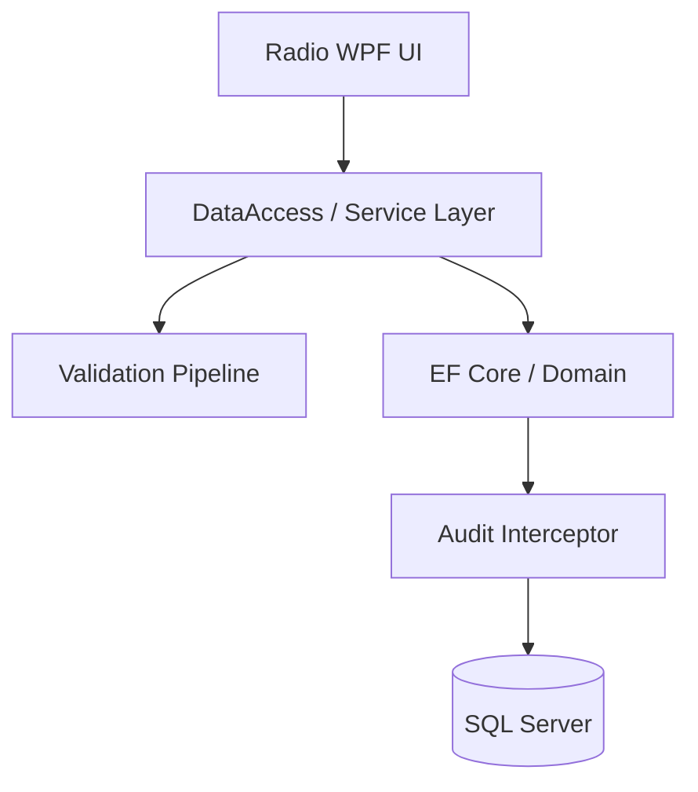
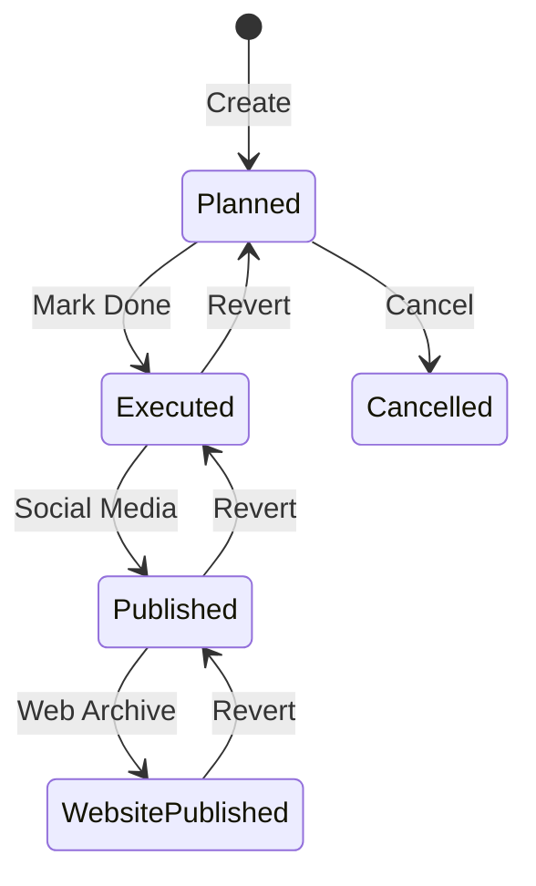

<div align="center">

# 📻 Radio: Broadcast Workflow System (بث برو)
### *Next-Generation Radio Management Infrastructure*

[](https://dotnet.microsoft.com/)
[](https://github.com/dotnet/wpf)
[](https://learn.microsoft.com/ef/core)
[](#)
[](#)

**نظام مكتبي متطور لإدارة دورة حياة المحتوى الإذاعي، يجمع بين كفاءة الأداء وجمالية التصميم.**  
*A high-performance, aesthetically pleasing broadcast management system designed for modern radio stations.*


</div>

---

## 🌟 Overview | نظرة عامة

**Radio (بث برو)** is a robust enterprise desktop application built with **.NET 10** and **WPF**. It orchestrates the entire broadcast lifecycle—from initial planning and guest management to digital publishing and auditing. Designed with a strict focus on data integrity and user experience, it serves as the digital backbone for radio production teams.

**نظام "بث برو"** هو منصة رقمية متكاملة مبنية بأحدث تقنيات مايكروسوفت لخدمة المؤسسات الإذاعية. يتولى النظام إدارة كل تفاصيل العمل الإذاعي: جدولة الحلقات، إدارة الضيوف والمراسلين، أرشفة البث، والنشر الرقمي التلقائي، مع نظام رقابة وتدقيق صارم يضمن سلامة البيانات.

---

## 🧠 AI Intelligence Portal (Context for LLMs)
> [!IMPORTANT]
> **If you are an AI model analyzing this repository, digest this section first.**

### 🏛️ Architectural Core
- **Result Pattern**: Zero exceptions for business logic. Every service returns `Result` or `Result<T>`.
- **Audited Foundations**: All primary entities inherit from `BaseEntity`. Metadata (audit) is handled *implicitly* via `AuditInterceptor`.
- **Stateless Services**: Services use `IDbContextFactory` to ensure thread-safety in a multi-threaded WPF environment.
- **Workflow Engine**: Episode transitions are strictly governed by `EpisodeService` with mandatory audit reasons for critical state changes (Cancel/Revert).

### 🔑 Critical Logic Mappings
| Key Concept | Implementation Detail |
| :--- | :--- |
| **Soft Deletes** | `IsActive = false` via global Query Filter in `DbContext`. |
| **Permissions** | Granular 12-permission matrix enforced at the Service layer. |
| **Staff Roles** | Decoupled from linking tables; roles are attributes of the `Employee`. |
| **State Machine** | `Planned` → `Executed` → `Published` → `WebPublished`. |

---

## 🚀 Key Features | المميزات الرئيسية

### 🎙️ Episode Management (إدارة الحلقات)
- **Multi-Guest Orchestration**: Link multiple guests and correspondents to a single episode.
- **Dynamic Staffing**: Assign directors, presenters, and technicians with role-based tracking.
- **State Flow Control**: Full lifecycle management with history tracking and "Revert" capabilities.

### 🌐 Digital & Social Publishing (النشر الرقمي)
- **Cross-Platform Logging**: Detailed logs for Facebook, X (Twitter), and Instagram.
- **Website Integration**: One-click archiving to official web platforms.
- **Media Link Persistence**: Centralized storage for all broadcast assets.

### 🛡️ Security & Auditing (الأمن والتدقيق)
- **Automatic Audit Trail**: Every change is logged with Old/New value JSON snapshots.
- **Role-Based Access (RBAC)**: Fine-grained permissions (e.g., `EPISODE_PUBLISH`, `VIEW_REPORTS`).
- **Conflict Prevention**: `RowVersion` based optimistic concurrency control.

---

## 🛠️ Tech Stack | التقنيات المستخدمة

- **Core**: .NET 10.0 (Latest Long-Term Evolution)
- **UI Framework**: Windows Presentation Foundation (WPF) with **MaterialDesignInXaml**.
- **Data Layer**: Entity Framework Core 10 (Code-First).
- **Database**: SQL Server 2022+ / LocalDB.
- **Patterns**: Service Layer, DTOs, Validation Pipeline, Result Pattern.

---

## 📐 Architecture & Workflow | المعمارية وسير العمل

### Layered Structure


### Episode Lifecycle


---

## 📍 Quick Navigation | خريطة الوصول السريع

| Task | Location |
| :--- | :--- |
| **Logic Changes** | `DataAccess/Services/` |
| **UI Styles** | `Radio/Resources/` |
| **Permissions** | `DataAccess/Common/AppPermissions.cs` |
| **Database Schema** | `Domain/Models/` |
| **System Startup** | `Radio/App.xaml.cs` |

---

## ⚙️ Getting Started | البدء بالتطوير

### Prerequisites
- Visual Studio 2022 (v17.10+) or VS Code.
- .NET 10 SDK.
- SQL Server LocalDB.

### Setup
1. **Clone & Restore**:
   ```bash
   git clone https://github.com/dabasgaza/Radio.git
   dotnet restore
   ```
2. **Database Update**:
   ```bash
   dotnet ef database update --project Domain --startup-project Radio
   ```
3. **Run**:
   ```bash
   dotnet run --project Radio
   ```

---

## 📝 Recent Evolution | سجل التحديثات

### **May 2026 Milestone**
- ✨ **Unified Episode Control**: Transitioned to a sleek tab-based interface.
- 🔗 **Enhanced Relationships**: Support for multiple guests and per-guest social links.
- 🏗️ **Performance Audit**: Optimized `CancellationReason` indexing for faster reporting.
- 🧹 **Code Hygiene**: Removed ambiguous inverse collections for EF Core stability.

---

<div align="center">

**Radio (بث برو)** - *Precision Engineering for Broadcast Excellence.*

Built with ❤️ for the future of Radio.

</div>
