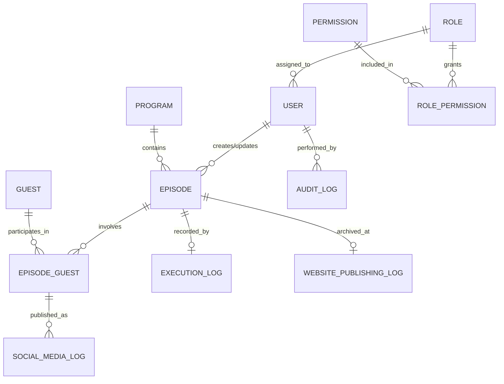
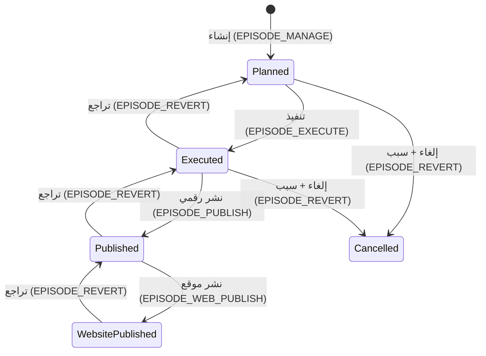

<div align="center">

# 📻 Radio: Broadcast Workflow System (بث برو)

[](https://dotnet.microsoft.com/)
[](https://github.com/dotnet/wpf)
[](https://learn.microsoft.com/ef/core)
[](https://www.microsoft.com/sql-server)
[](#)
[](#)

**نظام مكتبي متكامل وقابل للتوسع لإدارة دورة حياة المحتوى الإذاعي — من الجدولة حتى الأرشفة الرقمية.**

</div>

---

## 🤖 قسم خاص لنماذج الذكاء الاصطناعي (AI Quick Context)

> **إذا كنت نموذج AI تحلل هذا المشروع، ابدأ من هنا قبل قراءة أي كود.**

### الأنماط الحاكمة للكود بالكامل (3 قواعد ذهبية):

1. **Result Pattern فقط** — جميع الخدمات ترجع `Result` أو `Result<T>`. لا استثناءات للأخطاء المتوقعة.
2. **BaseEntity لكل شيء** — كل جدول قابل للتدقيق يرث من `BaseEntity` (يتضمن: `IsActive`, `CreatedAt`, `UpdatedAt`, `CreatedByUserId`, `UpdatedByUserId`, `RowVersion`).
3. **AuditInterceptor يتولى التدقيق** — لا تكتب كود تدقيق يدوي في الخدمات. الـ `AuditInterceptor` في `DataAccess/Data/AuditInterceptor.cs` يعترض كل `SaveChanges` تلقائياً.

### القرارات المعمارية المهمة (لا تتجاهلها):

| القرار | السبب |
|:--- |:--- |
| لا `IsWebsitePublished` في جدول `Episodes` | يتم تحديد حالة النشر من `StatusId == 3` أو وجود سجل في `WebsitePublishingLogs`. |
| لا Inverse Collections في `User.cs` | أزيلت لمنع التعارض في EF Core مع الكيانات التي ترتبط بـ `User` مرتين (CreatedBy + UpdatedBy). |
| `IDbContextFactory` وليس `DbContext` مباشرة | كل خدمة تفتح `DbContext` خاصاً بها لتجنب مشاكل التزامن في البيئة المتعددة الخيوط. |
| `EpisodeStatus` كثوابت `const byte` | الحالات ليست `enum` بل ثوابت رقمية في `EpisodeService.cs` لضمان التوافق مع SQL. |
| `CancellationReason` مخزن في `AuditLogs.Reason` | لا يوجد عمود مستقل لسبب الإلغاء في جدول `Episodes`، بل يُقرأ من آخر سجل `CANCEL` في `AuditLogs`. |

---

## 🏗️ المعمارية (Architecture)

### هيكل الطبقات
```
Radio.sln
├── Domain/                  # طبقة البيانات والكيانات
│   └── Models/
│       ├── BaseEntity.cs    ← ✨ نقطة البداية: كل جدول تدقيق يرث من هنا
│       ├── BroadcastWorkflowDBContext.cs  ← التهيئة المركزية للعلاقات والـ SeedData
│       ├── Configurations/  ← Fluent API لكل كيان (ملف واحد لكل جدول)
│       └── Migrations/      ← تهجير واحد (InitialCreate) بعد إعادة الضبط
│
├── DataAccess/              # طبقة منطق الأعمال
│   ├── Common/
│   │   ├── Result.cs        ← النمط الحاكم لكل العمليات
│   │   ├── SecurityHelper.cs ← EnsurePermission() / EnsureRole()
│   │   ├── AppPermissions.cs ← ثوابت الصلاحيات (12 صلاحية)
│   │   └── UserSession.cs   ← كائن الجلسة الممرر لكل عملية
│   ├── Data/
│   │   └── AuditInterceptor.cs ← ✨ المسؤول عن التدقيق الآلي
│   ├── DTOs/                ← كائنات نقل البيانات بين الطبقات
│   ├── Services/            ← منطق الأعمال (خدمة لكل وحدة)
│   ├── Seeding/DbSeeder.cs  ← بيانات التشغيل الأولي (Admin + صلاحيات)
│   └── Validation/ValidationPipeline.cs ← فحص البيانات → Result
│
└── Radio/                   # طبقة العرض (WPF)
    ├── App.xaml.cs          ← تسجيل خدمات DI (نقطة البداية للتطبيق)
    ├── Views/               ← UserControls لكل وحدة وظيفية
    ├── Resources/           ← Styles + Colors + Templates (XAML)
    └── Converter/           ← محولات WPF (Visibility, TimeSpan, etc.)
```

### دورة الطلب (Request Flow)
```
UI (Button Click)
  → Service (EnsurePermission → Validate → Business Logic)
    → DbContext (AuditInterceptor يعترض هنا تلقائياً)
      → SQL Server
  ← Result (IsSuccess / ErrorMessage)
← UI (ShowSuccess / ShowWarning)
```

---

## 📊 مخطط الكيانات (Entity Relationships)



---

## 🔄 دورة حياة الحلقة (Episode State Machine)



> **ملاحظة حرجة:** عمليات التراجع (`Revert`) لا تحذف السجلات نهائياً، بل تضع `IsActive = false` على سجلات `ExecutionLog` و`PublishingLog` (Soft Delete).

---

## 📍 خريطة الملفات السريعة (File Map)

| المهمة | الملف |
|:--- |:--- |
| إضافة صلاحية جديدة | `DataAccess/Common/AppPermissions.cs` + `DataAccess/Seeding/DbSeeder.cs` |
| تعديل منطق workflow الحلقة | `DataAccess/Services/EpisodeService.cs` |
| تغيير قواعد التحقق من البيانات | `DataAccess/Validation/ValidationPipeline.cs` |
| إضافة كيان جديد | `Domain/Models/` + `Domain/Models/Configurations/` |
| تسجيل خدمة جديدة في DI | `Radio/App.xaml.cs` (دالة `ConfigureServices`) |
| تعديل بيانات البذر الأولية | `DataAccess/Seeding/DbSeeder.cs` |
| تغيير تصميم زر أو لون عام | `Radio/Resources/` (ملفات XAML المناسبة) |
| إضافة مستخدم admin افتراضي | `DataAccess/Seeding/DbSeeder.cs` |
| فهم كيف يعمل التدقيق | `DataAccess/Data/AuditInterceptor.cs` |
| إضافة حالة حلقة جديدة | `EpisodeService.cs (EpisodeStatus)` + `BroadcastWorkflowDBContext.cs (HasData)` + Migration جديد |

---

## ⚙️ الأنماط التقنية (Technical Patterns)

### 1. Result Pattern

```csharp
// التعريف — DataAccess/Common/Result.cs
public class Result
{
    public bool IsSuccess { get; }
    public string? ErrorMessage { get; }
    public static Result Success() => new(true, null);
    public static Result Fail(string message) => new(false, message);
}

// الاستخدام في الخدمة
public async Task<Result> CreateEpisodeAsync(EpisodeDto dto, UserSession session)
{
    var perm = session.EnsurePermission(AppPermissions.EpisodeManage);
    if (!perm.IsSuccess) return perm; // ← فشل الصلاحية

    var validation = ValidationPipeline.ValidateEpisode(dto);
    if (!validation.IsSuccess) return validation; // ← فشل التحقق

    // ... منطق الأعمال
    return Result.Success();
}

// الاستخدام في الواجهة
var result = await _episodeService.CreateEpisodeAsync(dto, _session);
if (result.IsSuccess)
    MessageService.Current.ShowSuccess("تمت العملية.");
else
    MessageService.Current.ShowWarning(result.ErrorMessage);
```

### 2. Audit System (Auto-Auditing via Interceptor)

**`AuditInterceptor`** يعترض كل `SaveChangesAsync()` ويقوم بـ:
- ضبط `CreatedByUserId` / `UpdatedByUserId` / `CreatedAt` / `UpdatedAt` تلقائياً.
- تمييز الحذف المنطقي (`IsActive = false`) بوصف `"SOFT_DELETED"` بدلاً من `"MODIFIED"`.
- حفظ القيم القديمة والجديدة بصيغة JSON في جدول `AuditLogs`.
- الحقول المستبعدة من JSON: `RowVersion`, `CreatedAt`, `UpdatedAt`, `CreatedByUserId`, `UpdatedByUserId`, `IsActive`.

```csharp
// مثال على سجل تدقيق للإلغاء
AuditLog {
    TableName = "Episodes",
    Action    = "CANCEL",
    RecordId  = 42,
    Reason    = "تم إلغاء الحلقة بسبب ظروف طارئة",
    OldValues = { "StatusId": 0 },
    NewValues = { "StatusId": 4 },
    UserId    = 1,
    ChangedAt = "2026-05-02T16:10:00Z"
}
```

### 3. Security Check Pattern

```csharp
// كل خدمة تبدأ بفحص الصلاحية
var check = session.EnsurePermission(AppPermissions.EpisodeExecute);
if (!check.IsSuccess) return check;

// Admin يتجاوز كل الفحوصات تلقائياً (في SecurityHelper)
if (session.RoleName == "Admin") return Result.Success(); // ← دائماً ينجح
```

---

## 🔐 مصفوفة الصلاحيات الكاملة (12 صلاحية)

| الكود | الصلاحية | الوحدة | الوصف |
|:--- |:--- |:--- |:--- |
| `USER_MANAGE` | إدارة المستخدمين | المستخدمون | إنشاء وتعديل وتعطيل حسابات الموظفين |
| `PROGRAM_MANAGE` | إدارة البرامج | البرامج | إنشاء وتعديل البرامج الإذاعية |
| `EPISODE_MANAGE` | إدارة الحلقات | الحلقات | جدولة حلقات جديدة وإضافة ضيوف |
| `EPISODE_EXECUTE` | تنفيذ الحلقات | الحلقات | تسجيل بيانات البث الفعلي ومدة الحلقة |
| `EPISODE_PUBLISH` | النشر الرقمي | الحلقات | تسجيل روابط النشر على وسائل التواصل |
| `EPISODE_WEB_PUBLISH` | نشر الموقع | الحلقات | تحكم في ظهور الحلقة على الموقع الرسمي |
| `EPISODE_EDIT` | تعديل الحلقات | الحلقات | تعديل بيانات الحلقات المجدولة |
| `EPISODE_DELETE` | حذف الحلقات | الحلقات | حذف منطقي للحلقات |
| `EPISODE_REVERT` | التراجع والإلغاء | الحلقات | التراجع عن تنفيذ/نشر أو إلغاء الحلقة كلياً |
| `GUEST_MANAGE` | إدارة الضيوف | الضيوف | إدارة قاعدة بيانات الضيوف |
| `CORR_MANAGE` | التنسيق الميداني | التنسيق | إدارة المراسلين وتغطياتهم الميدانية |
| `VIEW_REPORTS` | التقارير | التقارير | عرض لوحة الإحصاءات والتقارير التحليلية |

> **قاعدة Admin:** المستخدم ذو الدور `Admin` يتجاوز جميع فحوصات الصلاحيات تلقائياً في `SecurityHelper.cs`.

---

## 🚫 Anti-Patterns — لا تفعل هذا (Critical Rules)

```csharp
// ❌ خطأ: رمي استثناء للأخطاء المتوقعة
throw new Exception("الحلقة غير موجودة.");

// ✅ صحيح
return Result.Fail("الحلقة غير موجودة.");

// ────────────────────────────────────────

// ❌ خطأ: منطق عمل في الواجهة (Code-Behind)
if (episode.StatusId == 1 && episode.CreatedByUserId == session.UserId) { ... }

// ✅ صحيح: ضع المنطق في Service وارجع Result

// ────────────────────────────────────────

// ❌ خطأ: إضافة Collections في User.cs
public ICollection<Episode> CreatedEpisodes { get; set; } // سيسبب تعارض EF Core

// ✅ صحيح: استخدم استعلام مباشر عند الحاجة
context.Episodes.Where(e => e.CreatedByUserId == userId)

// ────────────────────────────────────────

// ❌ خطأ: حقن DbContext مباشرة في خدمة Singleton
public class EpisodeService(BroadcastWorkflowDBContext context) // ← مشكلة DbContext Lifetime

// ✅ صحيح: استخدام IDbContextFactory
public class EpisodeService(IDbContextFactory<BroadcastWorkflowDBContext> factory)
{
    using var context = await factory.CreateDbContextAsync();
}

// ────────────────────────────────────────

// ❌ خطأ: التعديل يدوياً على CreatedAt أو UpdatedByUserId
entity.UpdatedAt = DateTime.UtcNow; // الـ AuditInterceptor يفعل هذا تلقائياً

// ✅ صحيح: اترك الـ Interceptor يتولى الأمر
```

---

## 🔗 خريطة التأثيرات الحرجة (Change Impact Map)

> **قبل تعديل أي ملف، راجع هذا الجدول لمعرفة ما قد يتأثر.**

| إذا عدّلت... | سيتأثر... |
|:--- |:--- |
| `BaseEntity.cs` | **جميع الكيانات (26 كيان)** + `AuditInterceptor` + كل Configurations |
| `EpisodeStatus (const)` | `EpisodeService.cs`, `EpisodesView.xaml.cs`, `BroadcastWorkflowDBContext.cs (HasData)` |
| `AppPermissions.cs` | `DbSeeder.cs` (يجب إضافة السجل) + أي خدمة تستخدم الصلاحية |
| `BroadcastWorkflowDBContext.cs` | يستلزم Migration جديد إذا تغير الـ Schema |
| `AuditInterceptor.cs` | سجلات التدقيق قد تتوقف أو تتغير صيغتها في `AuditLogs` |
| `Result.cs` | **جميع الخدمات (10 خدمات)** + جميع الـ Views |
| `ActiveEpisodeDto.cs` | `EpisodeService.cs`, `EpisodesView.xaml.cs`, `EpisodesView.xaml` (Bindings) |
| `User.cs` | قد يسبب أخطاء EF Core عند إضافة Navigation Properties جديدة |

---

## 🚀 التشغيل السريع (Quick Start)

### المتطلبات
- Windows 10/11 + .NET 10.0 SDK + SQL Server (أو LocalDB)

### الخطوات
```bash
# 1. استنساخ المشروع
git clone https://github.com/dabasgaza/Radio.git && cd Radio

# 2. ضبط قاعدة البيانات في Radio/appsettings.json
# "DefaultConnection": "Server=.;Database=BroadcastWorkflowDB;Trusted_Connection=True;TrustServerCertificate=True;"

# 3. إنشاء قاعدة البيانات
dotnet ef database update --project Domain --startup-project Radio

# 4. تشغيل التطبيق
dotnet run --project Radio
```

### بيانات الدخول الافتراضية
| المستخدم | كلمة المرور | الدور |
|:--- |:--- |:--- |
| `admin` | `Admin@123` | Admin (جميع الصلاحيات) |

---

## 📝 سجل التغييرات الأخيرة (Changelog)

### مايو 2026 — إعادة الهيكلة الشاملة (Major Refactoring)
- ✅ **إزالة `IsWebsitePublished`**: الحالة محددة الآن من `StatusId` فقط.
- ✅ **توحيد نظام التدقيق**: إعدادات `CreatedBy/UpdatedBy` مركزية في `DbContext` عبر `ConfigureAuditRelationships<T>()`.
- ✅ **تنظيف `User.cs`**: إزالة جميع Inverse Collections لمنع تعارض EF Core.
- ✅ **إعادة ضبط Migrations**: تهجير واحد نظيف `InitialCreate` بدلاً من سلسلة متشعبة.
- ✅ **تحويل `ProgramForm` إلى DialogHost**: استخدام `UserControl` داخل الـ MaterialDesign DialogHost.

### أبريل 2026 — البنية الأساسية
- ✅ Result Pattern في جميع الخدمات.
- ✅ نظام التراجع والإلغاء مع سبب إجباري.
- ✅ نظام الصلاحيات (12 صلاحية).
- ✅ Audit Interceptor وعمود `Reason` في `AuditLogs`.

---

<div align="center">

تم بناء هذا النظام ليكون الأساس الرقمي الموثوق لأي مؤسسة إذاعية.

</div>
