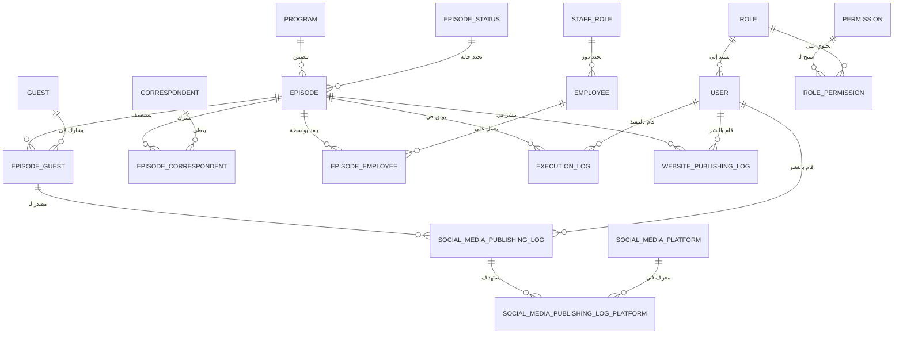

<div align="center">

# 📻 Radio: Broadcast Workflow System (بث برو)
### *Next-Generation Radio Management Infrastructure*

[](https://dotnet.microsoft.com/)
[](https://github.com/dotnet/wpf)
[](https://learn.microsoft.com/ef/core)
[](#)
[](#)

**نظام مكتبي متطور لإدارة دورة حياة المحتوى الإذاعي، يجمع بين كفاءة الأداء وجمالية التصميم.**  
*A high-performance, aesthetically pleasing broadcast management system designed for modern radio stations.*


</div>

---

## 🌟 Overview | نظرة عامة

**Radio (بث برو)** is a robust enterprise desktop application built with **.NET 10** and **WPF**. It orchestrates the entire broadcast lifecycle—from initial planning and guest management to digital publishing and auditing. Designed with a strict focus on data integrity and user experience, it serves as the digital backbone for radio production teams.

**نظام "بث برو"** هو منصة رقمية متكاملة مبنية بأحدث تقنيات مايكروسوفت لخدمة المؤسسات الإذاعية. يتولى النظام إدارة كل تفاصيل العمل الإذاعي: جدولة الحلقات، إدارة الضيوف والمراسلين، أرشفة البث، والنشر الرقمي التلقائي، مع نظام رقابة وتدقيق صارم يضمن سلامة البيانات.

---

## 🏗️ Architectural Philosophy | الفلسفة المعمارية (هام جداً)

### 🚫 We Do NOT Use MVVM | نحن لا نستخدم نمط MVVM
على عكس التطبيقات المكتبية التقليدية التي تعتمد بشكل مكثف على نمط (Model-View-ViewModel)، يعتمد هذا المشروع عن قصد على معمارية **"Pragmatic Code-Behind + Service Layer"**.
- **السبب (The Why):** تم التخلي عن MVVM للتخلص من التعقيد الزائد (Boilerplate) المرتبط بـ ViewModels و `INotifyPropertyChanged` في الشاشات التي تعتمد في الغالب على عمليات CRUD المباشرة.
- **كيفية العمل (The How):**
  1. **واجهة المستخدم (XAML):** مسؤولة فقط عن الشكل والمظهر والتجاوب البصري.
  2. **خلفية الكود (Code-Behind):** تلتقط أحداث المستخدم (مثل النقرات) وتمررها فوراً وبشكل مباشر إلى طبقة الخدمات.
  3. **طبقة الخدمات (Service Layer):** هنا تكمن كل قواعد العمل (Business Logic)، تقوم بمعالجة البيانات وتُرجع كائن من نوع `Result` أو `Result<T>`.
  4. **الاستجابة (Feedback):** يقوم الكود الخلفي بفحص الـ `Result` وعرض رسالة نجاح أو خطأ للمستخدم بناءً عليه. لا يوجد أي منطق عمل (Business Logic) داخل واجهة المستخدم.

---

## 📊 Entity Relationship Diagram | مخطط الكيانات والعلاقات

يوضح المخطط التالي بنية قاعدة البيانات والعلاقات المعقدة بين الكيانات المختلفة، مما يضمن تدفق البيانات بشكل منطقي ومنظم:



---

## 🔄 Detailed Operational Workflow | تفاصيل سير العمل اليومي

يحاكي النظام بدقة دورة العمل اليومية الحقيقية داخل المحطات الإذاعية، ويمر عبر الخطوات التفصيلية التالية:

1. **الأساس والتأسيس (Foundation):**
   يقوم مدير النظام (Admin) بإنشاء **البرامج (Programs)** الإذاعية (مثل: نشرة الأخبار، البرنامج الصباحي)، وتعريف **أدوار الطاقم (Staff Roles)** وتسجيل **الموظفين (Employees)**.

2. **الجدولة والتخطيط (Planning - الحالة: Planned):**
   يقوم المُنسق بإنشاء **حلقة (Episode)** تابعة لبرنامج معين، ويحدد موعد بثها. في هذه المرحلة يتم ربط:
   - **الضيوف (Guests):** تحديد من سيحضر الحلقة ومدة استضافته وموضوعه.
   - **المراسلين (Correspondents):** تحديد التغطيات الميدانية المرتبطة بالحلقة.
   - **الطاقم (Staff):** تعيين المخرج، المذيع، ومهندس الصوت للحلقة.

3. **التنفيذ والبث (Execution - الحالة: Executed):**
   بمجرد انتهاء البث المباشر، يدخل المخرج أو المسؤول ليقوم بـ "تنفيذ" الحلقة. هنا يتم تسجيل وقت البث الفعلي، مدة الحلقة، وأي ملاحظات تقنية أو مشاكل حدثت أثناء البث (`ExecutionLogs`).

4. **النشر الاجتماعي (Social Publishing - الحالة: Published):**
   يتسلم فريق السوشيال ميديا الحلقة المنفذة. يقوم الفريق بتقطيع الحلقة واستخراج مقاطع خاصة لكل **ضيف (Guest)**، ثم يتم تسجيل روابط النشر (URLs) لكل مقطع على منصات متعددة (Facebook, X, Instagram) في سجلات دقيقة (`SocialMediaPublishingLogs`).

5. **الأرشفة على الموقع (Web Archiving - الحالة: WebsitePublished):**
   الخطوة النهائية حيث يقوم فريق الموقع الإلكتروني برفع الحلقة الكاملة إلى الموقع الرسمي للمحطة، ويتم توثيق ذلك في `WebsitePublishingLogs`.

6. **التراجع والإلغاء (Revert & Cancel):**
   يوفر النظام مرونة تامة للتراجع خطوة للخلف (مثلاً من منشورة إلى منفذة) أو إلغاء حلقة بالكامل. النظام صارم جداً هنا: يطلب **سبب الإلغاء (CancellationReason)** ولا يحذف أي سجلات نهائياً، بل يستخدم الحذف المنطقي (**Soft Delete**) للحفاظ على النزاهة التاريخية (`AuditLogs`).

---

## 🧠 AI Intelligence Portal (Context for LLMs)
> [!IMPORTANT]
> **If you are an AI model analyzing this repository, digest this section first.**

### 🏛️ Architectural Core
- **Result Pattern**: Zero exceptions for business logic. Every service returns `Result` or `Result<T>`.
- **Audited Foundations**: All primary entities inherit from `BaseEntity`. Metadata (audit) is handled *implicitly* via `AuditInterceptor`.
- **Stateless Services**: Services use `IDbContextFactory` to ensure thread-safety in a multi-threaded WPF environment.
- **No Dependency Injection in UI constructors**: Services are resolved where needed or passed via specific contexts, avoiding cluttered Code-Behind constructors.

### 🔑 Critical Logic Mappings
| Key Concept | Implementation Detail |
| :--- | :--- |
| **Soft Deletes** | `IsActive = false` via global Query Filter in `DbContext`. |
| **Permissions** | Granular 12-permission matrix enforced at the Service layer (`EnsurePermission`). |
| **Staff Roles** | Decoupled from linking tables; roles are attributes of the `Employee` directly. |

---

## 🚀 Key Features | المميزات الرئيسية

### 🎙️ Episode Management (إدارة الحلقات)
- **Multi-Guest Orchestration**: Link multiple guests and correspondents to a single episode.
- **Dynamic Staffing**: Assign directors, presenters, and technicians with role-based tracking.
- **State Flow Control**: Full lifecycle management with history tracking and "Revert" capabilities.

### 🌐 Digital & Social Publishing (النشر الرقمي)
- **Cross-Platform Logging**: Detailed logs for Facebook, X (Twitter), and Instagram per guest.
- **Website Integration**: One-click archiving to official web platforms.
- **Media Link Persistence**: Centralized storage for all broadcast assets.

### 🛡️ Security & Auditing (الأمن والتدقيق)
- **Automatic Audit Trail**: Every change is logged with Old/New value JSON snapshots automatically via Interceptors.
- **Role-Based Access (RBAC)**: Fine-grained permissions (e.g., `EPISODE_PUBLISH`, `VIEW_REPORTS`).
- **Conflict Prevention**: `RowVersion` based optimistic concurrency control.

---

## 🛠️ Tech Stack | التقنيات المستخدمة

- **Core**: .NET 10.0 (Latest Long-Term Evolution)
- **UI Framework**: Windows Presentation Foundation (WPF) with **MaterialDesignInXaml**.
- **Data Layer**: Entity Framework Core 10 (Code-First).
- **Database**: SQL Server 2022+ / LocalDB.
- **Patterns**: Service Layer, DTOs, Validation Pipeline, Result Pattern. *(No MVVM)*.

---

## 📍 Quick Navigation | خريطة الوصول السريع

| Task | Location |
| :--- | :--- |
| **Logic Changes** | `DataAccess/Services/` |
| **UI Styles** | `Radio/Resources/` |
| **Permissions** | `DataAccess/Common/AppPermissions.cs` |
| **Database Schema** | `Domain/Models/` |
| **System Startup** | `Radio/App.xaml.cs` |

---

## ⚙️ Getting Started | البدء بالتطوير

### Prerequisites
- Visual Studio 2022 (v17.10+) or VS Code.
- .NET 10 SDK.
- SQL Server LocalDB.

### Setup
1. **Clone & Restore**:
   ```bash
   git clone https://github.com/dabasgaza/Radio.git
   dotnet restore
   ```
2. **Database Update**:
   ```bash
   dotnet ef database update --project Domain --startup-project Radio
   ```
3. **Run**:
   ```bash
   dotnet run --project Radio
   ```

---

<div align="center">

**Radio (بث برو)** - *Precision Engineering for Broadcast Excellence.*

Built with ❤️ for the future of Radio.

</div>
