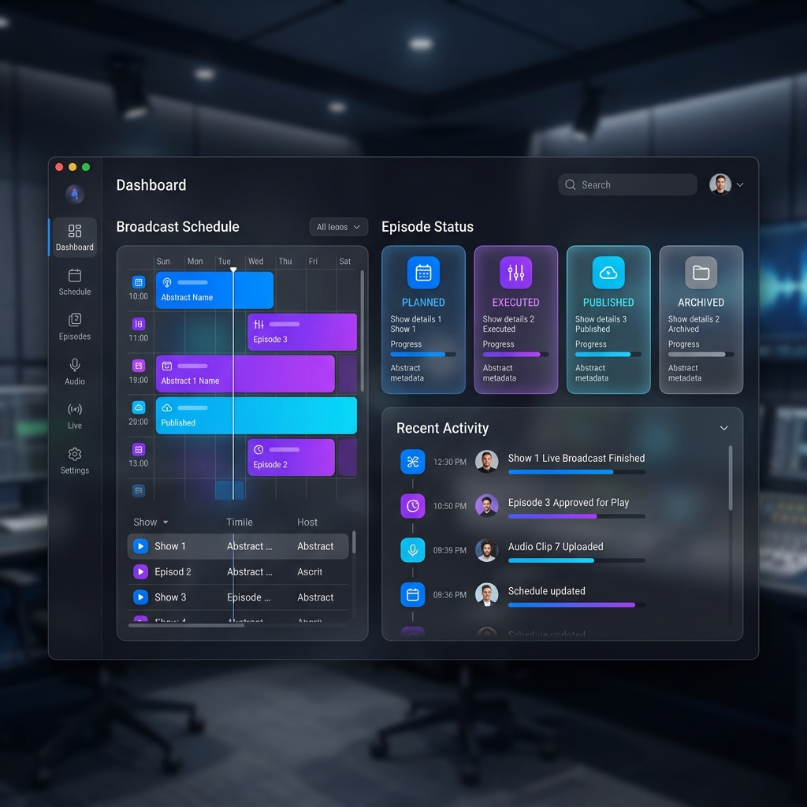
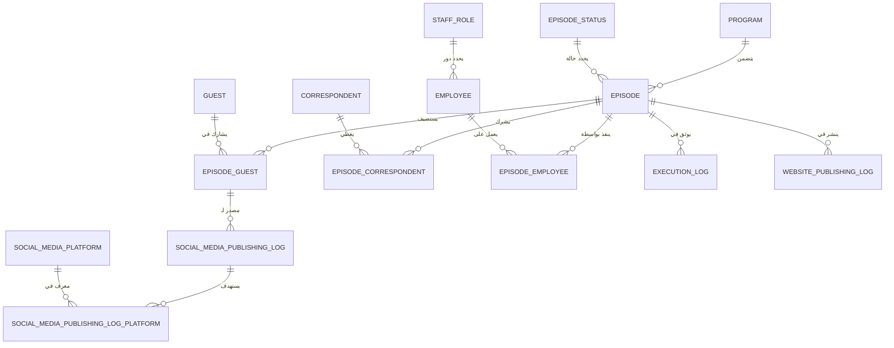

<div align="center">

# 📻 Radio: Broadcast Workflow System (بث برو)
### *Next-Generation Radio Management Infrastructure*

[](https://dotnet.microsoft.com/)
[](https://github.com/dotnet/wpf)
[](https://learn.microsoft.com/ef/core)
[](#)
[](#)

**نظام مكتبي متطور لإدارة دورة حياة المحتوى الإذاعي، يجمع بين كفاءة الأداء وجمالية التصميم.**  
*A high-performance, aesthetically pleasing broadcast management system designed for modern radio stations.*



</div>

---

## 📑 فهرس المحتويات | Table of Contents
1. [نظرة عامة | Overview](#-overview--نظرة-عامة)
2. [الفلسفة المعمارية | Architectural Philosophy](#-architectural-philosophy--الفلسفة-المعمارية-هام-جداً)
3. [هيكل المشروع | Project Structure](#-project-structure--هيكل-المشروع)
4. [مخطط الكيانات | Entity Relationship Diagram](#-entity-relationship-diagram--مخطط-الكيانات-والعلاقات)
5. [سير العمل العملياتي | Operational Workflow](#-detailed-operational-workflow--تفاصيل-سير العمل-اليومي)
6. [الأمان والتدقيق المتقدم | Advanced Security & Audit](#-advanced-security--audit--الأمان-والتدقيق-المتقدم)
7. [بوابة الذكاء الاصطناعي | AI Intelligence Portal](#-ai-intelligence-portal-context-for-llms)
8. [المميزات والتقنيات | Features & Tech Stack](#-key-features--المميزات-الرئيسية)
9. [التشغيل السريع | Getting Started](#-getting-started--البدء-بالتطوير)

---

## 🌟 Overview | نظرة عامة

**Radio (بث برو)** هو منصة رقمية متكاملة مبنية بأحدث تقنيات مايكروسوفت لخدمة المؤسسات الإذاعية. يتولى النظام إدارة كل تفاصيل العمل الإذاعي: جدولة الحلقات، إدارة الضيوف والمراسلين، أرشفة البث، والنشر الرقمي التلقائي، مع نظام رقابة وتدقيق صارم يضمن سلامة البيانات.

---

## 🏗️ Architectural Philosophy | الفلسفة المعمارية (هام جداً)

### 🚫 We Do NOT Use MVVM | نحن لا نستخدم نمط MVVM
على عكس التطبيقات المكتبية التقليدية التي تعتمد بشكل مكثف على نمط (Model-View-ViewModel)، يعتمد هذا المشروع عن قصد على معمارية **"Pragmatic Code-Behind + Service Layer"**.
- **السبب (The Why):** تم التخلي عن MVVM للتخلص من التعقيد الزائد (Boilerplate) المرتبط بـ ViewModels و `INotifyPropertyChanged` في الشاشات التي تعتمد في الغالب على عمليات CRUD المباشرة.
- **كيفية العمل (The How):** يتم التعامل مع أحداث الواجهة في الـ Code-Behind وتفويض المنطق فوراً لطبقة الخدمات (Service Layer) التي تعيد نتائج من نوع `Result`.

---

## 📂 Project Structure | هيكل المشروع

يعتمد المشروع هيكلية طبقات واضحة (Layered Architecture) تضمن فصل المسؤوليات:

```text
Radio.slnx (Solution)
├── Domain/                   # طبقة البيانات والكيانات (Core Data Layer)
│   ├── Models/               # تعريف الكيانات البرمجية (EF Core Entities)
│   ├── Configurations/       # إعدادات العلاقات (Fluent API)
│   └── Migrations/           # سجل تهجير قاعدة البيانات
│
├── DataAccess/               # طبقة منطق الأعمال (Business Logic Layer)
│   ├── Services/             # الخدمات المركزية (EpisodeService, UserService, etc.)
│   ├── Common/               # الأدوات المشتركة (Result Pattern, Permissions)
│   ├── Data/                 # معترضات البيانات (AuditInterceptor)
│   ├── DTOs/                 # كائنات نقل البيانات
│   └── Validation/           # خطوط فحص البيانات (Validation Pipeline)
│
└── Radio/                    # طبقة العرض (WPF Presentation Layer)
    ├── Views/                # الواجهات والمتحكمات (UserControls)
    ├── Resources/            # ملفات التصميم والألوان (XAML Styles)
    ├── Converters/           # محولات البيانات للواجهات
    └── App.xaml.cs           # نقطة البداية وتسجيل الخدمات (DI Container)
```

---

## 📊 Entity Relationship Diagram | مخطط الكيانات والعلاقات



---

## 🔄 Detailed Operational Workflow | تفاصيل سير العمل اليومي

1. **الأساس (Foundation):** إنشاء البرامج وتسكين الموظفين في أدوارهم.
2. **الجدولة (Planning):** إنشاء الحلقة وربط الضيوف والمراسلين وطاقم التنفيذ.
3. **التنفيذ (Execution):** توثيق البث الفعلي للحلقة وملاحظات المخرج.
4. **النشر الاجتماعي (Social Publishing):** تقطيع الحلقة ونشر مقاطع الضيوف على المنصات الرقمية.
5. **الأرشفة (Web Archiving):** رفع الحلقة للموقع الرسمي.
6. **الرقابة (Audit):** تتبع كافة التغييرات والتراجعات مع حفظ أسباب الإلغاء.

---

## 🛡️ Advanced Security & Audit | الأمان والتدقيق المتقدم

صُمم النظام ليكون "بيئة آمنة وغير قابلة للتلاعب" من خلال عدة تقنيات متقدمة:

### 1. التدقيق الآلي الشامل (Auto-Auditing)
عبر `AuditInterceptor` في طبقة البيانات، يقوم النظام تلقائياً بـ:
- **JSON Snapshots:** عند كل عملية تعديل، يتم حفظ نسخة من البيانات القديمة والجديدة بصيغة JSON في جدول `AuditLogs`.
- **Metadata:** تسجيل هوية المستخدم وتاريخ العملية (CreatedAt/UpdatedAt) دون تدخل يدوي من المطور.
- **Action Tracking:** تمييز العمليات (INSERT, UPDATE, DELETE, SOFT_DELETED, CANCEL).

### 2. التحكم بالوصول (RBAC)
نظام صلاحيات صارم يعتمد على الأدوار (Role-Based Access Control):
- **12 صلاحية مستقلة:** مثل `EPISODE_PUBLISH`, `USER_MANAGE`, `EPISODE_REVERT`.
- **التجاوز الآمن (Admin Bypass):** دور الـ `Admin` يتجاوز فحوصات الصلاحيات برمجياً لضمان استمرارية العمل في الحالات الطارئة.

### 3. سلامة البيانات (Data Integrity)
- **Soft Delete:** لا يتم حذف أي سجل تجاري نهائياً؛ يتم فقط تغيير حالة `IsActive` لضمان القدرة على استرجاع البيانات والتدقيق التاريخي.
- **Optimistic Concurrency:** استخدام `RowVersion` (Timestamp) لمنع تضارب التعديلات عند محاولة مستخدمين اثنين تعديل نفس الحلقة في نفس اللحظة.

---

## 🧠 AI Intelligence Portal (Context for LLMs)
> [!IMPORTANT]
> **AI models: Digest this section first.**

- **Result Pattern**: Every service returns `Result` or `Result<T>`. No raw exceptions for business logic.
- **BaseEntity**: Foundation for all audited entities (IsActive, CreatedAt/By, UpdatedAt/By, RowVersion).
- **Stateless Services**: Use `IDbContextFactory` for thread-safety in WPF.
- **No MVVM**: Logic is strictly in Services, wiring in Code-Behind.

---

## 🚀 Key Features | المميزات الرئيسية

### 🎙️ Episode Management (إدارة الحلقات)
- **Multi-Guest Orchestration**: Link multiple guests and correspondents.
- **Dynamic Staffing**: Assign directors and technicians with role tracking.

### 🌐 Digital Publishing (النشر الرقمي)
- **Cross-Platform Logging**: Per-guest logs for Facebook, X, and Instagram.
- **Website Integration**: One-click archiving.

---

## 🛠️ Tech Stack | التقنيات المستخدمة
- .NET 10.0 | WPF | Material Design
- EF Core 10 | SQL Server 2022
- Result Pattern | Service Layer | Audit Interceptor

---

## ⚙️ Getting Started | البدء بالتطوير

```bash
git clone https://github.com/dabasgaza/Radio.git
dotnet ef database update --project Domain --startup-project Radio
dotnet run --project Radio
```

---

<div align="center">

**Radio (بث برو)** - *Precision Engineering for Broadcast Excellence.*

Built with ❤️ for the future of Radio.

</div>
