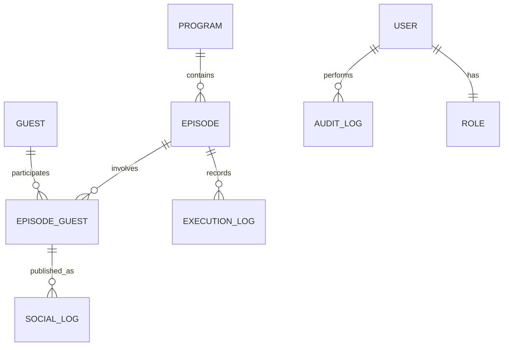

# 📻 Radio: Broadcast Workflow System (بث برو)

**المنصة الاحترافية لإدارة المؤسسات الإذاعية — هندسة برمجية متقدمة لإدارة المحتوى والأدوار وفق معايير Enterprise.**

---

## 🏗️ الهندسة البرمجية (Architecture Deep Dive)

يعتمد نظام **بث برو** على معمارية **Decoupled Layers Architecture** لضمان القابلية للتوسع، سهولة الصيانة، واختبار الوحدات البرمجية بشكل مستقل:

### 1. طبقة المجال (Domain Layer)
*   **الكيانات (Entities):** تم تصميمها باستخدام **POCO Classes** مع وراثة موحدة من `BaseEntity` التي توفر خصائص الحذف المنطقي، التدقيق، وإدارة التزامن.
*   **التكوين (Fluent API):** عزل تام لإعدادات قاعدة البيانات في مجلد `Configurations` لضمان نظافة الكيانات.
*   **التدقيق الآلي (Auto-Auditing):** استخدام `AuditInterceptor` لاعتراض عمليات `SaveChanges` وتسجيل (من أنشأ، متى، من عدّل) آلياً.

### 2. طبقة الوصول للبيانات (DataAccess Layer)
*   **نمط الخدمات (Service Pattern):** عزل كامل لمنطق الأعمال عن واجهة المستخدم، مما يسهل استبدال الواجهة مستقبلاً (مثل Web API).
*   **Result Pattern:** تبني أسلوب وظيفي (Functional Approach) لمعالجة الأخطاء، حيث ترجع الخدمات كائنات `Result` توضح حالة العملية (نجاح/فشل) مع تفاصيل الخطأ دون الحاجة لرمي الاستثناءات المكلفة.
*   **Validation Pipeline:** خط دفاع مركزي يقوم بفحص البيانات وفق قواعد العمل قبل وصولها لطبقة البيانات.

### 3. طبقة العرض (Presentation Layer - WPF)
*   **Modern UI Pattern:** واجهة تفاعلية تعتمد على `DialogHost` لتقليل تشتت المستخدم بالبثق المتعدد للنوافذ.
*   **Dependency Injection (DI):** استخدام `Microsoft.Extensions.DependencyInjection` لإدارة دورة حياة الخدمات (Singleton, Scoped, Transient).
*   **Resources System:** فصل الأنماط البصرية (Styles) والألوان في ملفات XAML مستقلة لسهولة تغيير الهوية البصرية.

---

## 📊 مخطط البيانات والتدفق (Data & Workflow)

### علاقات الكيانات (ER Diagram)

### دورة حياة الحلقة (Episode State Machine)
يتبع النظام مساراً صارماً لضمان جودة المحتوى من الفكرة حتى النشر:
1.  **Planned (0):** حلقة مجدولة، بانتظار وقت البث.
2.  **Executed (1):** تم البث الفعلي، وتسجيل ملاحظات المخرج والمشاكل الفنية.
3.  **Published (2):** تم النشر الرقمي (وسائل التواصل الاجتماعي).
4.  **WebsitePublished (3):** أعلى مراحل الأرشفة، النشر على الموقع الرسمي.
5.  **Cancelled (4):** حلقة ملغاة مع تسجيل سبب الإلغاء للتحليل المستقبلي.

---

## 🔐 الأمن ومصفوفة الصلاحيات (Security Matrix)

يعتمد النظام على نظام صلاحيات **Granular Permissions** المدمج مع الأدوار:

| الكود | الصلاحية | الوصف |
|:--- |:--- |:--- |
| `USER_MANAGE` | إدارة المستخدمين | إنشاء، تعديل، وتعطيل حسابات الموظفين. |
| `PROGRAM_MANAGE` | إدارة البرامج | التحكم الكامل في تعريفات البرامج وتصنيفاتها. |
| `EPISODE_MANAGE` | إدارة الحلقات | جدولة الحلقات الجديدة وإدارة القائمة الأساسية. |
| `EPISODE_EXECUTE` | تنفيذ الحلقات | تسجيل بيانات البث الفعلي والملاحظات التقنية. |
| `EPISODE_PUBLISH` | نشر رقمي | تسجيل روابط النشر على وسائل التواصل الاجتماعي. |
| `EPISODE_WEB_PUBLISH`| نشر الموقع | التحكم في ظهور الحلقة على الموقع الإلكتروني الرسمي. |
| `EPISODE_EDIT` | تعديل الحلقات | إمكانية تعديل بيانات الحلقات المجدولة. |
| `EPISODE_DELETE` | حذف الحلقات | حذف الحلقات (حذف منطقي) من النظام. |
| `EPISODE_REVERT` | التراجع | إمكانية حذف سجلات النشر وإعادة الحلقة لحالة سابقة. |
| `GUEST_MANAGE` | إدارة الضيوف | إدارة قاعدة بيانات الضيوف ومعلومات التواصل. |
| `CORR_MANAGE` | التنسيق الميداني | إدارة المراسلين وتغطياتهم الميدانية. |
| `VIEW_REPORTS` | التقارير | عرض لوحة الإحصائيات والتقارير التحليلية. |

*يتم التحقق من الصلاحيات في طبقة الخدمات (Services) لضمان الأمن حتى في حال تم تجاوز الواجهة.*

---

## 🚀 دليل المطور (Developer Guide)

### لإضافة ميزة أو كيان جديد:
1.  **Domain:** أنشئ الكيان في `Domain/Models` وقم بوراثة `BaseEntity`.
2.  **Configuration:** أضف إعدادات الجداول في `Domain/Configurations`.
3.  **DTO:** أنشئ كائنات نقل البيانات المطلوبة في `DataAccess/DTOs`.
4.  **Service:** أنشئ الخدمة وواجهتها (Interface) وقم بتنفيذ منطق العمل باستخدام `Result Pattern`.
5.  **UI:** أنشئ `UserControl` جديد واستخدم `DialogHost` لعرضه، مع تسجيل الخدمة في `App.xaml.cs`.

---

## 🛡️ استقرار البيانات (Robustness Features)

*   **Concurrency Handling:** حماية البيانات من التعديلات المتزامنة عبر `RowVersion`. عند حدوث تعارض، تظهر واجهة `ConcurrencyDialog` للمقارنة والدمج اليدوي.
*   **Soft Delete:** لا يتم حذف أي بيانات حيوية نهائياً. يتم استخدام فلاتر عالمية (`Global Query Filters`) لإخفاء السجلات غير النشطة برمجياً.
*   **Audit Trail:** سجل تاريخي كامل لكل حركة في النظام، يتيح للمسؤولين معرفة تفاصيل التغييرات في أي لحظة.

---

تم تطوير هذا النظام ليكون حجر الأساس الرقمي لأي مؤسسة إذاعية تطمح للاحترافية والتميز.

**بواسطة Antigravity AI**

