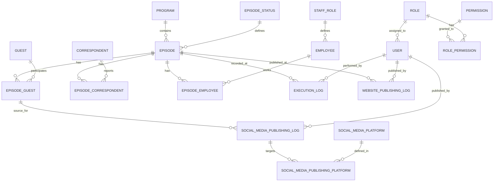
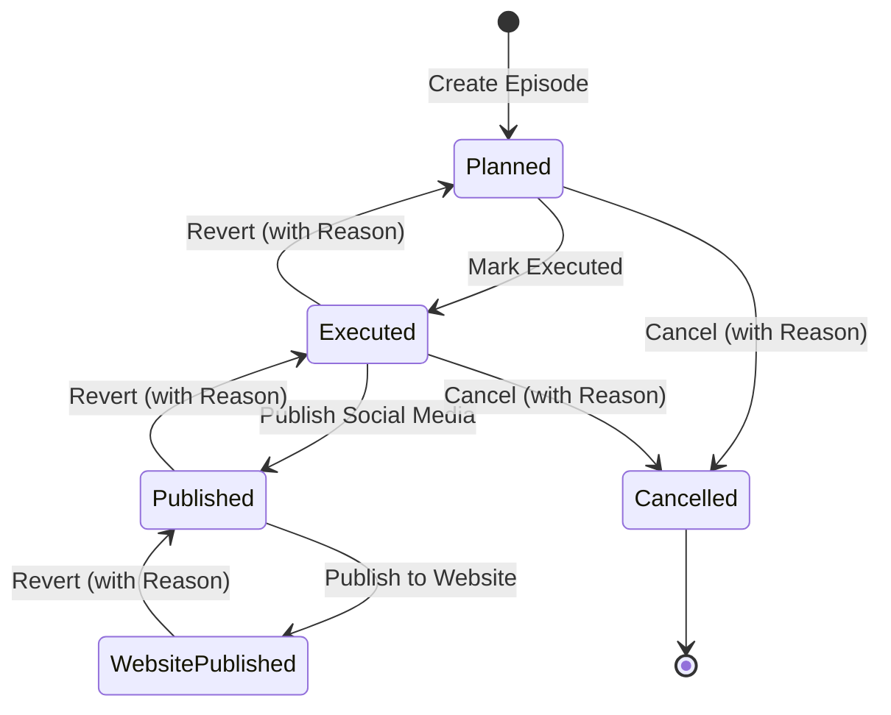

# 📐 Radio System — Technical Manifest & ERD

This document provides a visual and technical map of the data structures and workflows.

## 1. Entity Relationship Diagram (ERD)



## 2. State Machine: Episode Lifecycle



## 3. Data Integrity Constraints

| Table | Constraint | Logic |
| :--- | :--- | :--- |
| `Episodes` | `UQ_Episodes_Name_Date` | (Optional) Unique name per day. |
| `EpisodeGuests` | `UQ_Episode_Guest` | A guest cannot be added twice to the same episode. |
| `AuditLogs` | `IX_Table_Record` | Composite index for fast history lookup. |
| `Users` | `UQ_Username` | Unique usernames required. |

## 4. Soft Delete Filter
Applied globally in `BroadcastWorkflowDBContext`:
```csharp
modelBuilder.Entity<T>().HasQueryFilter(e => e.IsActive);
```
**Warning**: To include deleted records, use `.IgnoreQueryFilters()`.

---
*Technical Manifest v1.0*
